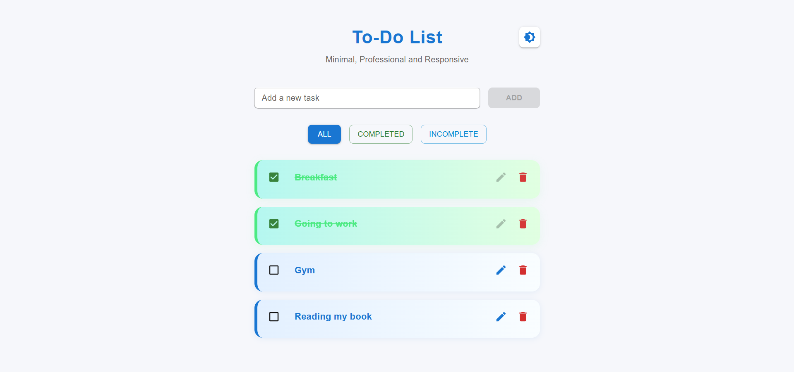
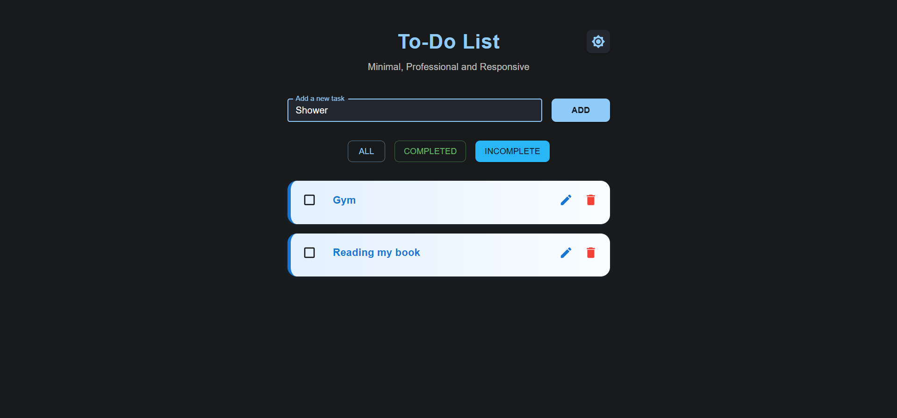

## 🚀 Live Demo

Click here to open the To-Do List app:  
[](https://hazem-gouda.github.io/to-do-list)


# 📝 To-Do List App

A simple and responsive **To-Do List** web application built with **React** and **Material UI**. This app helps users manage their daily tasks by adding, completing, and removing to-dos in an organized way.

## 🚀 Features

- Add new tasks
- Mark tasks as completed
- Delete tasks
- Responsive design
- Modern Material UI components

## 🛠️ Built With

- [React](https://reactjs.org/) – JavaScript library for building user interfaces
- [Material UI](https://mui.com/) – React components for faster and easier web development

## 📸 Screenshots





----------------------------------------------------------------------------

This project is licensed under the MIT License - feel free to use and modify it.

Made with ❤️ by Hazem Gouda

## 📦 Installation
```bash
# Clone the repository
git clone https://github.com/hazem-gouda/to-do-list.git

# Navigate to the project directory
cd to-do-list

# Install dependencies
npm install

# Start the development server
npm start
